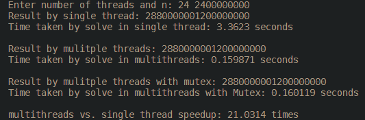

# thread-practice

Use C++ demo multithread.
sum 1 to n and compare different with single thread, multithread, multithread with Mutex

## demo

### compile

```bash
g++ main.cpp -o main.exe
```

### execute

```bash
./main.exe
```

### test case

```
24 2400000000
```

### result


